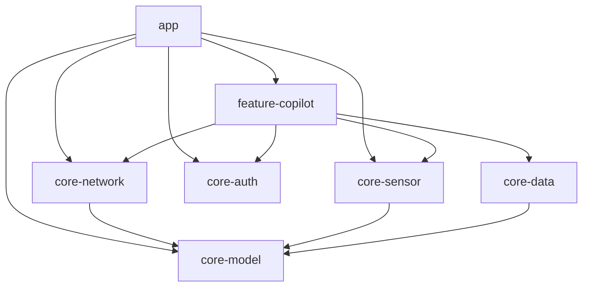

# Vigia2 Wiki

This wiki maps the repository layout and the module relationships discovered from the codebase-memory index.

## Repository Layout

- [[app]]
- [[feature-copilot]]
- [[core-model]]
- [[core-network]]
- [[core-sensor]]
- [[core-data]]
- [[core-auth]]
- [[build-logic]]

## Dependency Overview

## Notes

- The architecture documents describe a smaller target set, but the repository currently also contains [[core-data]] and [[core-auth]].
- Shared models live in [[core-model]].
- Runtime and hardware integration flows are centered in [[core-sensor]] and [[core-network]].